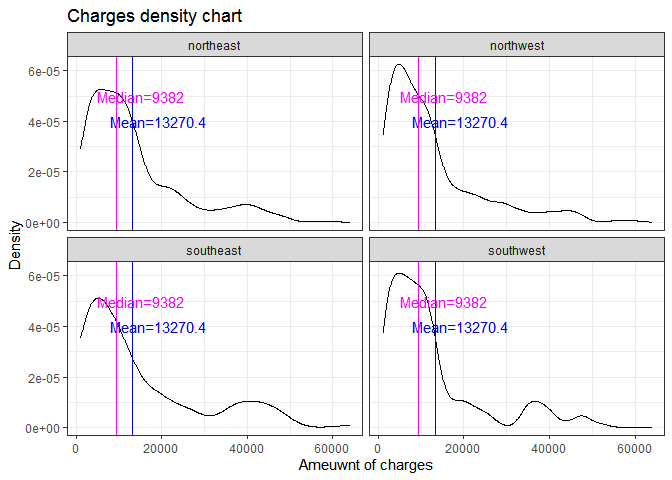

homework1
================

\#Загрузка необходимых библиотек

``` r
library(dplyr)
```

    ## 
    ## Присоединяю пакет: 'dplyr'

    ## Следующие объекты скрыты от 'package:stats':
    ## 
    ##     filter, lag

    ## Следующие объекты скрыты от 'package:base':
    ## 
    ##     intersect, setdiff, setequal, union

``` r
library(ggplot2)
library(skimr)
library(tidyr)
library(purrr)
library(ggpubr)
#install.packages("wesanderson")
library(wesanderson)
```

# Загрузка дата-сета

<br>

``` r
insurance_cost <- read.csv('insurance_cost.csv', stringsAsFactors = T)
head(insurance_cost)
```

    ##   age    sex    bmi children smoker    region   charges
    ## 1  19 female 27.900        0    yes southwest 16884.924
    ## 2  18   male 33.770        1     no southeast  1725.552
    ## 3  28   male 33.000        3     no southeast  4449.462
    ## 4  33   male 22.705        0     no northwest 21984.471
    ## 5  32   male 28.880        0     no northwest  3866.855
    ## 6  31 female 25.740        0     no southeast  3756.622

``` r
skim(insurance_cost)
```

|                                                  |                |
|:-------------------------------------------------|:---------------|
| Name                                             | insurance_cost |
| Number of rows                                   | 1338           |
| Number of columns                                | 7              |
| \_\_\_\_\_\_\_\_\_\_\_\_\_\_\_\_\_\_\_\_\_\_\_   |                |
| Column type frequency:                           |                |
| factor                                           | 3              |
| numeric                                          | 4              |
| \_\_\_\_\_\_\_\_\_\_\_\_\_\_\_\_\_\_\_\_\_\_\_\_ |                |
| Group variables                                  | None           |

Data summary

**Variable type: factor**

| skim_variable | n_missing | complete_rate | ordered | n_unique | top_counts                             |
|:--------------|----------:|--------------:|:--------|---------:|:---------------------------------------|
| sex           |         0 |             1 | FALSE   |        2 | mal: 676, fem: 662                     |
| smoker        |         0 |             1 | FALSE   |        2 | no: 1064, yes: 274                     |
| region        |         0 |             1 | FALSE   |        4 | sou: 364, nor: 325, sou: 325, nor: 324 |

**Variable type: numeric**

| skim_variable | n_missing | complete_rate |     mean |       sd |      p0 |     p25 |     p50 |      p75 |     p100 | hist  |
|:--------------|----------:|--------------:|---------:|---------:|--------:|--------:|--------:|---------:|---------:|:------|
| age           |         0 |             1 |    39.21 |    14.05 |   18.00 |   27.00 |   39.00 |    51.00 |    64.00 | ▇▅▅▆▆ |
| bmi           |         0 |             1 |    30.66 |     6.10 |   15.96 |   26.30 |   30.40 |    34.69 |    53.13 | ▂▇▇▂▁ |
| children      |         0 |             1 |     1.09 |     1.21 |    0.00 |    0.00 |    1.00 |     2.00 |     5.00 | ▇▂▂▁▁ |
| charges       |         0 |             1 | 13270.42 | 12110.01 | 1121.87 | 4740.29 | 9382.03 | 16639.91 | 63770.43 | ▇▂▁▁▁ |

<br>

# Вывод гистограммы всех нумерических переменных.

``` r
insurance_cost %>%
  keep(is.numeric) %>% 
  gather() %>% 
  ggplot(aes(value)) +
    facet_wrap(~ key, scales = "free") +
    geom_histogram(bins = 20) +
    theme_light()
```

<!-- -->

# График плотности по колонке charges.

<br>

``` r
mean <- round(mean(insurance_cost$charges),1)
median <- round(median(insurance_cost$charges),1)

ch_density <-insurance_cost %>%
  ggplot() +
  geom_density(aes(x = charges)) +
  geom_vline(aes(xintercept = mean), color = "blue") +
  annotate("text", 
           x= mean+6000, 
           y = 4e-05, 
           label=paste0("Mean=", mean), color = "blue") +
  geom_vline(aes(xintercept = median), color = "magenta") +
  annotate("text", 
           x= median+6000, 
           y = 5e-05, 
           label=paste0("Median=", median), color = "magenta") +
  ggtitle("Charges density chart") +
  labs(x = "Ameuwnt of charges", y = "Density") +
  theme_bw()

ch_density
```

<!-- --> <br>

# Ящик с усами по отношению переменных charges и (1) sex (2) smoker (3) region.

``` r
ch_sex <- insurance_cost %>%
  ggplot()+
  geom_boxplot(aes(x = charges, y = sex)) + 
  labs(x = "Charges", y = "Sex") +
  theme_bw()
ch_sex
```

<!-- -->

``` r
ch_smoker <- insurance_cost %>%
  ggplot()+
  geom_boxplot(aes(x = charges, y = smoker)) + 
  labs(x = "Charges", y = "Whether they smoke or not") +
  theme_bw()
ch_smoker
```

<!-- -->

``` r
ch_region <- insurance_cost %>%
  ggplot()+
  geom_boxplot(aes(x = charges, y = region)) + 
  labs(x = "Charges", y = "Region") +
  theme_bw()
ch_region
```

<!-- --> <br>

# Объединение “ящиков с усами” и графика плотности

<br>

``` r
boxes <- ggarrange(ch_sex, ch_smoker, ch_region, ncol = 3, nrow = 1)
combined_plots <-ggarrange(ch_density, boxes, ncol = 1, nrow = 2)
annotate_figure(combined_plots, top = text_grob("Chharges, their density and how they vary depending on sex, region and smoking", size = 13, face = "bold"))
```

<!-- --> <br>

# Фасет графика из задания 3 по колонке region

<br>

``` r
ch_density + facet_wrap(.~region)
```

<!-- --> <br>

# Scatter plot отношения переменных age и charges

<br>

``` r
scatterplot <- insurance_cost %>%
  ggplot() + 
  geom_point(aes(x = age, y = charges)) +
  ggtitle("Dependance of the charges amount on age") +
  labs(x = "Age", y = "Charges") +
  theme_bw()
scatterplot + theme(axis.text.x = element_text(size = 14)) 
```

<!-- --> <br>

# Линия тренда для предыдущего графика

<br>

``` r
insurance_cost %>%
  ggplot(aes(x = age, y = charges)) + 
  geom_point() +
  geom_smooth(method = lm, 
              color = "magenta", 
              fullrange = T,
              fill = "blue",
              se = TRUE,
              size = 0.5) +
  ggtitle("Dependance of the charges amount on age") +
  labs(x = "Age", y = "Charges") +
  theme_bw() + 
  theme(axis.text.x = element_text(size = 14)) 
```

<!-- --> <br>

# Разбивка предыдущего графика по колонке smokers

<br>

``` r
insurance_cost %>%
  ggplot(aes(x = age, y = charges, color = smoker, fill = smoker, group = smoker)) + 
  geom_point() +
  geom_smooth(method = lm, 
              color = "magenta", 
              fullrange = T,
              fill = "blue",
              se = TRUE,
              size = 0.5) +
  ggtitle("Dependance of the charges amount on age") +
  labs(x = "Age", y = "Charges") +
  theme_bw() + 
  theme(axis.text.x = element_text(size = 14))
```

    ## `geom_smooth()` using formula 'y ~ x'

<!-- --> <br>

# Вместо переменной age переменная bmi

<br>

``` r
insurance_cost %>%
  ggplot(aes(x = bmi, y = charges, color = smoker, fill = smoker, group = smoker)) + 
  geom_point() +
  geom_smooth(method = lm, 
              color = "magenta", 
              fullrange = T,
              fill = "blue",
              se = TRUE,
              size = 0.5) +
  ggtitle("Dependance of the charges amount on BMI") +
  labs(x = "BMI", y = "Charges") +
  theme_bw() + 
  theme(axis.text.x = element_text(size = 14))
```

    ## `geom_smooth()` using formula 'y ~ x'

<!-- --> <br>

# Вопросы к данным

<br>

## Вопрос №1.

<br>

Does BMI tends to increase if a person smokes?

<br>

Let’s make a box-plot to have a look at BMI and how it varies as it
would be more informative

<br>

``` r
insurance_cost %>%
  filter(smoker == 'yes') %>%
  ggplot(aes(x = bmi, y = sex)) +
  geom_boxplot() +
  labs(y = "sex", x = "BMI") +
  ggtitle("BMI, sex, smoking") +
  theme_bw() +
  coord_flip() 
```

<!-- --> <br>

**Looking at the graphs, we can conclude that the BMI of smokers does
not differ significantly by gender, however, the median value in both
cases corresponds to preobesity.**

<br>

## Вопрос №2

<br> Is there any dependence on the charges if a woman has kids

``` r
insurance_cost$has_children <- ifelse(insurance_cost$children == 0, "no","yes")
insurance_cost$has_children <- factor(insurance_cost$has_children, levels = c('yes' , 'no'))
insurance_cost %>%
  filter(sex == "female") %>%
  
  ggplot(aes(x = age, y = charges, color = has_children, fill = has_children, group = has_children)) + 
  geom_point() +
  geom_smooth(method = lm, 
              color = "magenta", 
              fullrange = T,
              fill = "blue",
              se = TRUE,
              size = 0.5) +
  ggtitle("Dependance of the charges amount on age") +
  labs(x = "Age", y = "Charges") +
  theme_bw() + 
  theme(axis.text.x = element_text(size = 14))
```

    ## `geom_smooth()` using formula 'y ~ x'

<!-- -->

<br> **Despite there’s an upward tendensy with age, I don’t think
there’s a sagnifficant difference whether they have kids or not**

<br>

# Повторение графика

``` r
#names(wes_palettes)
pal <- wes_palette("GrandBudapest1", 1)


i_c <- insurance_cost %>%
   mutate(
    age_group = case_when(
      age < 35 ~ "21-34",
      age >= 35 & age < 50 ~ "35-49",
      age >= 50 ~ "50+"
    ))
i_c %>%
  ggplot(aes(x = bmi, y = log(charges), color = age_group, fill = age_group, group = age_group)) +
  geom_point(color = pal, alpha = 0.2) +
  facet_grid(.~ age_group) +
  geom_smooth(method=lm,
              alpha = 0.2,
              se=TRUE,
              size = 0.2,
              group = "age_group") +
ggtitle("Отношение индекса массы тела к логарифму трат по возрастным группам") +
theme_minimal() +
theme(legend.position = "bottom")
```

<!-- -->
